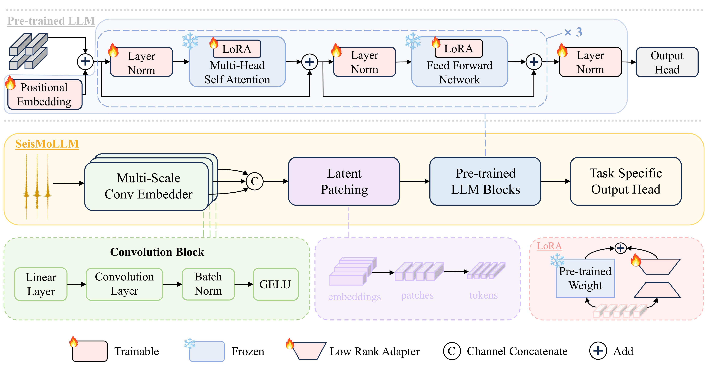
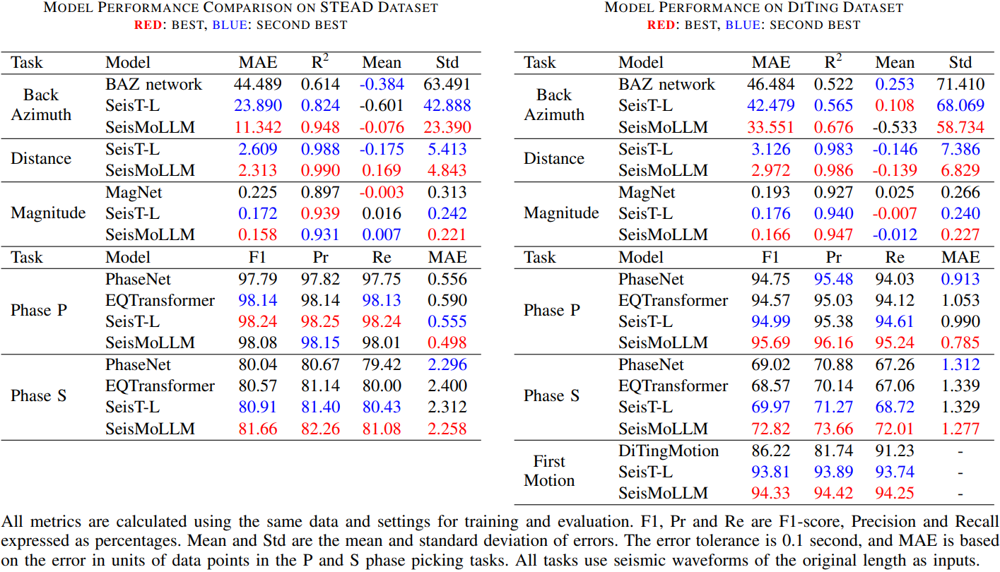
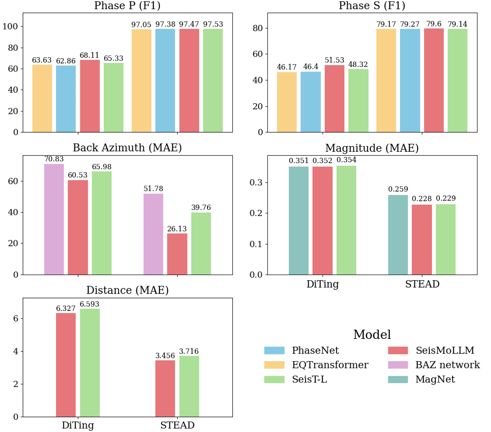
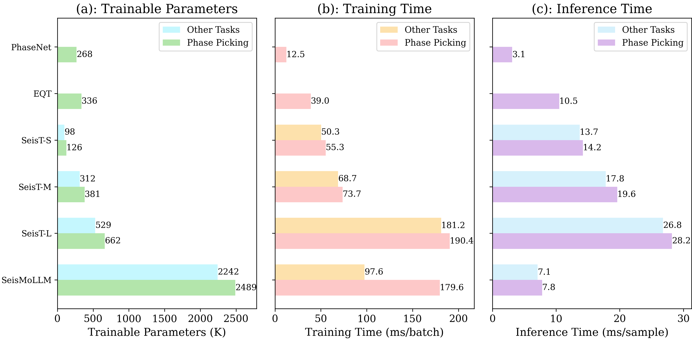

<div align="center">

[](https://opensource.org/license/MIT)
[](https://arxiv.org/abs/2502.19960)

## [**SeisMoLLM: Advancing Seismic Monitoring via Cross-modal Transfer <br> with Pretrained Large Language Model**](https://arxiv.org/abs/2502.19960)

[Xinghao Wang](https://github.com/StarMoonWang)<sup>1,2</sup>, [Feng Liu](https://github.com/liufeng2317)<sup>3,1</sup>, Rui Su<sup>1</sup>, 
[Zhihui Wang](https://faculty.dlut.edu.cn/2010015018/en/index.htm)<sup>2</sup>, Lihua Fang<sup>4</sup>, Lianqing Zhou<sup>4</sup>, [Lei Bai](http://leibai.site/)<sup>1</sup>, [Wanli Ouyang](https://wlouyang.github.io/)<sup>1</sup>

<sup>1</sup> [Shanghai AI Laboratory](https://www.shlab.org.cn/), <sup>2</sup> [DUT-RU ISE, Dalian University of Technology](https://drise.dlut.edu.cn/), <br>
<sup>3</sup> [SEIEE, Shanghai Jiao Tong University](https://www.seiee.sjtu.edu.cn/), <sup>4</sup> [Institute of Earthquake Forecasting, China Earthquake Administration](https://www.ief.ac.cn/home/)

</div>

---

- [🔥 Introduciton](#-introduction)
- [✨ Highlights](#-highlights)
- [⚡️ Usage](#%EF%B8%8F-usage)
- [👍 Acknowledgement](#-acknowledgement)
- [🎓 Citation](#-citation)


## 🔥 Introduction
Large-scale pretraining for seismic monitoring remains challenging due to the lack of effective pretraining algorithms, the high cost of training, and the significant variations across existing datasets. These obstacles have seriously hindered the development of domain foundation models. 
SeisMoLLM is the first work to explore the **cross-modality transfer** strategy for seismic monitoring, unleashing the power of pretraing by adapting a pretrained LLM (GPT-2 here) to build a powerflu and general-purpose model.  
With a unified network architecture, SeisMoLLM can handle various seismic monitoring tasks, including back-azimuth estimation, epicentral distance estimation, magnitude estimation, phase picking, and first-motion polarity classification, demonstrating its potential as a foundation model for seismology.
<p align = "center">  

</p>


## ✨ Highlights
1. Surperising performance: With standard supervised training on DiTing-light and STEAD datasets, SeisMoLLM achieves the state-of-the-art performance across the above five tasks, getting 36 best results out of 43 task metrics, with many
relative improvements ranging from 10% to 50% compared to advanced baselines.
<p align = "center">  

</p>
2. Excerllent generalization: Using only 10% data as training set, SeisMoLLM consistently attains better results than the train-from-scratch baselines, with 12 top scores out of 16 metrics.
<p align = "center">  

</p>
3. Modest cost: Despite the introduction of large language models, SeisMoLLM still maintains low training cost and rapid inference speed that is comparable to or even better than lightweight baselines. Training only takes 3-36 hours on 4× RTX-4090 GPUs.
<p align = "center">  

</p>


## ⚡️ Usage

### 🛠️ Preparation
- Install required environment by running ` pip install -r requirements.txt `
- Download required datasets, you can find STEAD at the [STEAD repo](https://github.com/smousavi05/STEAD), and DiTing dataset requires a request for access, please contact the authors of its paper. Then change the `--data` to your local data path.
- Prepare pre-trained GPT-2 model files at [huggingface gpt2](https://huggingface.co/openai-community/gpt2/tree/main) and place them in the `your_dir/GPT2` directory, then change the **GPT_file_path** in `models/SeisMoLLM.py` to `your_dir`. We suggest to download manually because huggingface is blocked in many areas.

### 🚀 Running
To start training or evaluation, run the scripts in `run_scripts`. Try `python main.py --help` to see description of every hyperparameter so you can tune the arguments. For model selection, the task abbreviations used in the model names are listed in the table below:

  <div align="center">
  <table><tbody>

  <th valign="bottom">Task</th>
  <th valign="bottom">Abbreviation</th>

  <tr><td align="left"><del>Detection &amp;</del> Phase Picking</td>
  <td align="left">dpk</td>

  <tr><td align="left">First-Motion Polarity Classification</td>
  <td align="left">pmp</td>

  <tr><td align="left">Back-Azimuth Estimation</td>
  <td align="left">baz</td>

  <tr><td align="left">Magnitude Estimation</td>
  <td align="left">emg</td>

  <tr><td align="left">Epicentral Distance Estimation</td>
  <td align="left">dis</td>

  </tbody></table>
  </div>
  
If you want to use a custom dataset, model, or change the task settings, in addition to implement your codes following the provided examples, please remember to modify `config.py`.
 

## 👍 Acknowledgement
Our code is developed based on [SeisT](https://github.com/senli1073/SeisT) codebase. Thanks for their great work.

## 🎓 Citation
Hopefully, if our work helps, please give us a star ⭐ or cite this work with:  
```
@misc{wang2025seismollmadvancingseismicmonitoring,
      title={SeisMoLLM: Advancing Seismic Monitoring via Cross-modal Transfer with Pre-trained Large Language Model}, 
      author={Xinghao Wang and Feng Liu and Rui Su and Zhihui Wang and Lihua Fang and Lianqing Zhou and Lei Bai and Wanli Ouyang},
      year={2025},
      eprint={2502.19960},
      archivePrefix={arXiv},
      primaryClass={cs.LG},
      url={https://arxiv.org/abs/2502.19960}, 
}
```
